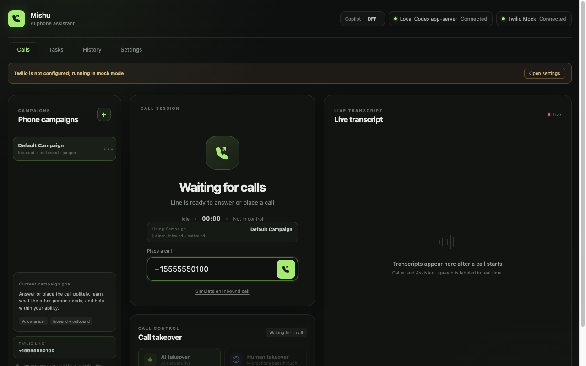
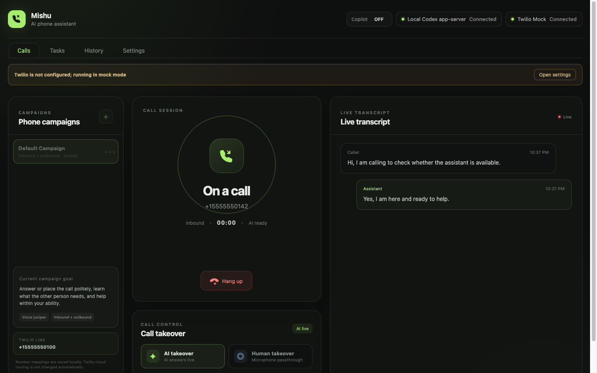
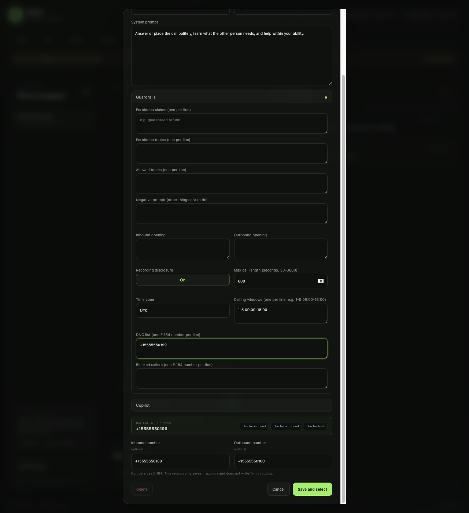
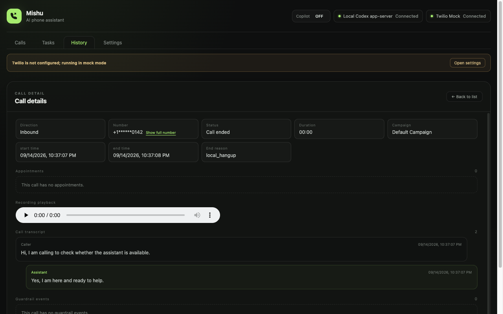
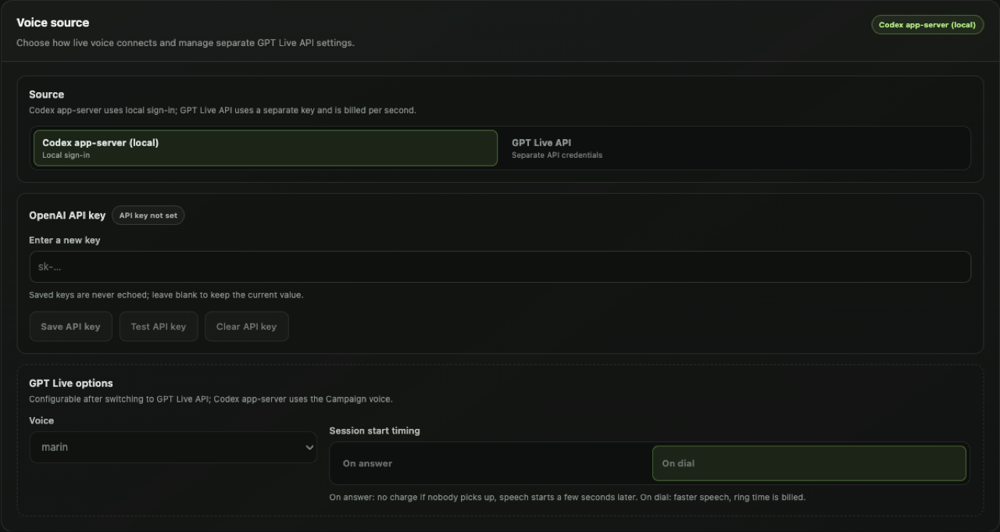

# Mishu (working name)

A private AI phone secretary for people, and an HTTP `/v1` API for other agents. Mishu answers and places calls, acts inside the Owner's authority, blocks abuse, and hands off to a human when needed.

It is **local-first**: the desktop engine keeps Twilio credentials, model keys, transcripts, and campaign prompts on your machine. The same engine also runs as a headless single-tenant reference host so agents can talk to `/v1` without Electron.

**Status:** developer preview. Not a production SLA. Copyright and trademarks: YOMOO LLC. Mishu is a working name; this README does not claim a registered trademark.

Official builds disclose that the caller is speaking with AI on the first spoken turn. A campaign cannot turn that off.

## Screenshots

Mock mode, fictional `+1555…` numbers.



*Calls page in mock mode, waiting for a call.*



*A simulated inbound call, answered, with a live transcript and AI / human takeover.*



*Campaign editor with guardrails expanded: persona, calling hours, DNC, recording disclosure.*



*Call history detail: transcript of a completed mock call.*



*Settings → Voice source. Choose the Codex app-server (optional local adapter) or the GPT-Live API.*

## Features

- **Answer and place calls** on a desktop engine (mock by default; Twilio when you bring an account).
- **AI takeover and human handoff** on a live call (microphone passthrough).
- **Campaigns and guardrails**: persona, openings, calling hours, DNC, recording notice. Opening AI disclosure is mandatory.
- **Call history**: transcripts, recordings when present, JSON export. Structured analysis is available over `/v1` and the CLI.
- **Tasks**: queued outbound work from the UI, HTTP, MCP, or the CLI.
- **Webhooks** with `X-Mishu-Signature` / `X-Mishu-Event` / `X-Mishu-Delivery-Id`.
- **MCP server** so Claude Desktop and the Codex CLI can drive the local engine.
- **`mishu` CLI** (`apps/cli`) as a `/v1` client.
- **Headless reference host** (`apps/cloud`) with the same stores and mock ports.

## Requirements

- **Node.js 22 or newer** (`node:sqlite` is required) and [pnpm](https://pnpm.io/) 11.x (see `packageManager` in `package.json`).
- **macOS** for the desktop app. Official packaging is macOS arm64 `.dmg`, ad-hoc signed. Linux and Windows desktop hosts are not supported yet.
- **Optional Twilio account** for real PSTN calls. Mock mode needs none.
- **A voice source**, one of:
  - Codex app-server (optional local adapter): install the Codex CLI and sign in. No OpenAI API key.
  - GPT-Live API: an OpenAI API key, billed per second of voice session.

Workspace packages import as `@mishu/core`, `@mishu/contracts`, and so on (`"private": true`). Official npm packages will use the `@yomoo` scope (`@yomoo/mishu-core`, `@yomoo/mishu-sdk`, …) and are **not yet published**. Do not `npm install` them.

## Quick start (mock mode, no accounts)

```bash
git clone https://github.com/YOMOO-LLC/mishu.git
cd mishu
pnpm install
pnpm check
pnpm dev
```

`pnpm check` runs boundary lint, typecheck, unit tests, and the cloud contract kit (`pnpm test:contract:cloud`).

`pnpm dev` opens the Electron console with `LIVE_PHONE_USE_MOCKS=1`. You can:

- click **Simulate an inbound call**, answer it, and watch the live transcript;
- type `15555550100` and place a mock outbound call;
- switch **AI takeover** / **Human takeover** while the call is up.

The footer shows mock mode. No PSTN, no paid APIs.

## Real calls

Bring your own Twilio account. Follow [docs/en/twilio-setup.md](docs/en/twilio-setup.md) for API key/secret, TwiML App, Voice SDK tokens, incoming routing, and where settings go (Settings → Phone line, or `.env` from [`.env.example`](.env.example)).

You are responsible for Twilio charges, TCPA, and recording-consent law. Official builds still disclose AI identity.

```bash
pnpm dev:twilio   # localhost-only /token helper on 127.0.0.1:8787
```

Do not expose `/token` on the public internet.

## Voice source

Open **Settings → Voice source**.

| Source | What you need | Billing |
|---|---|---|
| Codex app-server (optional local adapter) | Codex CLI installed and signed in | Your Codex CLI plan; no GPT-Live per-second charge |
| GPT-Live API | OpenAI API key in Settings (or `OPENAI_API_KEY`) | OpenAI bills voice seconds |

The Codex app-server path keeps login on-device. GPT-Live API keys stay in the main process; the renderer never echoes a saved key.

## Using it

### Campaigns and guardrails

Create or edit a campaign on the Calls page. Set direction, voice, and system prompt (persona). Expand **Guardrails** for openings, calling-hour windows, DNC, blocked callers, and recording disclosure.

Platform policy is compiled first: AI disclosure, calling hours, DNC, consent. A campaign can only tighten a rule. See [docs/en/guardrails.md](docs/en/guardrails.md).

### Placing and answering calls

Outbound: select a campaign that allows outbound, enter an E.164 number, dial. Inbound: answer from the Calls page (or simulate in mock mode). Campaign number mappings are metadata; they do not reconfigure Twilio routing.

### Takeover

On an active call, **AI takeover** lets the assistant speak. **Human takeover** routes your microphone to the caller. Hangup returns the next inbound call to AI.

### History and export

The History tab lists completed calls. Open a row for transcript, recording playback when present, guardrail events, and JSON export. Masked numbers stay masked until you reveal them.

### CLI

The `/v1` client is `mishu` (`apps/cli`). After `pnpm install`:

```bash
pnpm exec mishu --help
pnpm exec mishu status
pnpm exec mishu campaigns ls
pnpm exec mishu call --to +15555550100
pnpm exec mishu simulate-incoming
```

`status`, `campaigns ls`, `call`, and `simulate-incoming` need a running local engine (desktop with MCP/API enabled, or `pnpm cloud`) and a bearer token. Pass `--endpoint` and `--token`, or let the CLI read the local token file. Numbers in examples are `+1555…` only.

## Agents and automation

### MCP (Claude Desktop and Codex CLI)

Enable the MCP server in Settings. The config shape is a stdio shim; substitute your own user-data directory — do not copy a machine path from someone else.

Claude Desktop (`mcpServers`):

```json
{
  "mcpServers": {
    "live-phone": {
      "command": "node",
      "args": ["./scripts/mcp-stdio-shim.mjs"],
      "env": {
        "LIVE_PHONE_USER_DATA_PATH": "<your-app-user-data-dir>"
      }
    }
  }
}
```

Codex CLI (`~/.codex/config.toml`):

```toml
[mcp_servers."live-phone"]
command = "node"
args = ["./scripts/mcp-stdio-shim.mjs"]
env = { LIVE_PHONE_USER_DATA_PATH = "<your-app-user-data-dir>" }
```

Restart the client after editing. The MCP surface is a `/v1` client with local-first constraints (loopback, read-only sandbox, no interactive approval UI).

### `/v1` HTTP API

The OpenAPI document is [docs/api/openapi.json](docs/api/openapi.json). The headless host prints `{ ready, baseUrl, tokenFile }` and writes the bearer token to `tokenFile` (mode `0600`). It never prints the token. Desktop stores the token next to MCP state under the app user-data directory.

### Webhooks

Deliveries use `X-Mishu-Signature: t=<unix-ms>,v1=<hex>` over `timestamp.body`. Related headers: `X-Mishu-Event`, `X-Mishu-Delivery-Id`. See [examples/webhook-receiver](examples/webhook-receiver).

## Headless reference host and contract kit

`apps/cloud` is a single-tenant `/v1` host with mock ports by default. It is not multi-tenant Cloud.

```bash
pnpm cloud
```

Optional flags: `--data-dir <path>`, `--port <n>`. Without `--data-dir` the process uses an ephemeral directory and deletes it on stop. Stop with Ctrl+C.

The same black-box suite in `tests/contract/` must pass on every engine:

```bash
pnpm test:contract:cloud
```

That command starts `apps/cloud`, injects `CONTRACT_BASE_URL` / `CONTRACT_TOKEN`, then stops. To point the kit at an already-running engine:

```bash
CONTRACT_BASE_URL=http://127.0.0.1:8788/v1 \
CONTRACT_TOKEN="$(cat /path/to/tokenFile)" \
pnpm test:contract
```

Do not paste real tokens into logged shells. Do not point the kit at production user data.

## Build a desktop release

macOS arm64 `.dmg`, ad-hoc signed:

```bash
pnpm release
```

That runs the desktop package script (`electron-builder --mac --arm64`) from `apps/desktop`. Output lands under `apps/desktop/release/` (ignored by git). Codesign is ad-hoc; Gatekeeper will still prompt.

## Architecture

One engine, one `/v1` contract, five ports, replaceable adapters. Short map: [docs/en/architecture.md](docs/en/architecture.md). Port interfaces: [docs/en/ports.md](docs/en/ports.md).

Public layout: `apps/desktop`, `apps/cloud`, `apps/cli`, `packages/*`.

## Guardrails and acceptable use

Official builds keep AI disclosure, calling hours, DNC, and consent **on**. See [docs/en/guardrails.md](docs/en/guardrails.md) and [AUP.md](AUP.md). Public docs do not explain how to hide that the assistant is AI.

## Troubleshooting

1. **Footer says Demo / mock mode.** `LIVE_PHONE_USE_MOCKS=1` is the default. Turn mocks off in Settings → Phone line (or drop the env var) only after Twilio settings are saved. Simulate inbound is mock-only.
2. **`pnpm dev` reports Electron uninstall.** A fresh `pnpm install` can leave the Electron binary off disk. Run `pnpm rebuild electron` (or `node -e "require('electron')"` once) and retry. Do not kill other Electron apps on the machine.
3. **Codex CLI is not signed in.** Local voice needs the Codex CLI on `PATH` (or `CODEX_BIN`) and a logged-in session. The Calls header reports the Codex app-server connection from observed state; it will not show Connected until the process is actually ready.
4. **Microphone permission.** Human takeover and real Twilio audio need macOS microphone access for the app. Grant it in System Settings → Privacy & Security → Microphone, then relaunch.
5. **Port already in use.** `pnpm dev:twilio` binds `127.0.0.1:8787`. `pnpm cloud` picks an ephemeral port unless you pass flags such as `--port 18791` (no extra `--` before them). Another process on 8787 will make token fetch fail.
6. **`pnpm exec mishu` cannot reach the app.** Start desktop (MCP/API enabled) or `pnpm cloud`, then pass `--endpoint` and `--token`, or confirm the token file the host printed as `tokenFile`.

## Contributing

See [CONTRIBUTING.md](CONTRIBUTING.md) (DCO, mocks by default, English-only shipping code).

## Security

Report vulnerabilities privately. See [SECURITY.md](SECURITY.md).

## License

MIT. See [LICENSE](LICENSE).

## Trademark

The MIT license does not grant rights in the Mishu name, logo, or wordmark. See [TRADEMARK.md](TRADEMARK.md).
