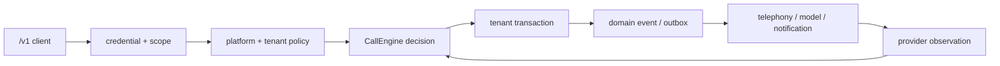

# ADR-0001: Call-engine foundation and the unified `/v1` contract

- Date: 2026-09-12
- Status: Accepted
- Decision owners: product owner, foundation maintainers
- Related: [ADR-0002](0002-secretary-domain-model.md), [ADR-0003](0003-channels-and-connectors.md), [ADR-0004](0004-open-source-boundary.md)
- Source: internal ADR-0001 (Chinese)

## Decision

Ship **one** host-agnostic call engine and **one** versioned `/v1` HTTP contract. Desktop, a 24-hour personal cloud secretary, and a public API for other agents are three deployments of that engine, not three products.

The engine is:

1. A `CallEngine` core for the control plane and intelligence plane.
2. A small set of ports (storage, media, models, secrets, notifications, approval). Five of those ports are extracted today; see [ports.md](../ports.md).
3. A versioned `/v1` HTTP contract and event schema.
4. The same contract-test kit against every engine.

Desktop UI, mobile, `mishu` CLI, MCP, and third-party SDKs are `/v1` clients. Desktop IPC may remain an internal optimization. It must not become a second domain contract.

Two deployments matter for v1:

| Deployment | Runs the engine? | Data and keys | Media |
|---|---|---|---|
| Desktop local | Yes, inside Electron main | On-device SQLite/files; the user's own Twilio / model keys | Twilio Voice SDK + WebRTC. Codex app-server (optional local adapter) is local-only. |
| Cloud engine | Yes, as a service | Server database / secret manager | Twilio Media Streams to GPT-Live WebSocket; Conference for owner handoff. |

Desktop-as-cloud-client, mobile, CLI, MCP, and SDKs do **not** run the engine. They hold short-lived credentials and call `/v1`.

The local engine exposes the same contract at loopback (`http://127.0.0.1:<port>/v1`). Switching engines is a base URL and a bearer token. Product intent is both a free local API simulator and a privacy-first desktop that uses the user's own keys, in one install.

Production media (validated with live calls) is Twilio Media Streams ↔ GPT-Live WebSocket, with pcm24k exchanged against μ-law 8k. ConversationRelay is a documented fallback, not the production path. Raw audio never travels on `/v1`, webhooks, MCP, or SSE.

## Context

The private repo began as a single-user Electron app: main owned services, SQLite, and secrets; the renderer `PhoneController` owned the Twilio Voice SDK, WebRTC audio, and dial/hangup. `/v1`, MCP, and CLI already covered most business operations, but the implementation assumed localhost, one active call, and no tenant dimension.

The product must serve three scenes at once: a privacy-first desktop, a personal cloud secretary that answers around the clock, and an API other agents can call. Wrapping the Electron tree as a "shared library that runs everywhere" is the wrong cut. Freezing a host-agnostic engine and a versioned contract is the right one.

S1 confirmed the cloud media plane with real calls: opening latency on the order of a few hundred milliseconds, Conference transfer that moves the caller once, and timeout fallback that keeps the caller on AI voicemail instead of dropping them. That second implementation satisfied the rule of two, so ports could be extracted.

## Consequences

Local, cloud, mobile, and developer API share schema, errors, idempotency, and state-machine semantics. Vendors and hosts become replaceable adapters.

The cost is tenant, version, contract-test, and event-compatibility discipline starting now. Desktop stays at the private-repo root (option A); the public snapshot maps it to `apps/desktop/`. `apps/cloud` is a single-tenant reference host, not a second engine.

Opening AI disclosure is a platform rule. Campaigns cannot disable it. Cloud AI outbound v1 is limited to Owner-initiated, Owner-errand calls that disclose AI on the first turn. Marketing and bulk outbound are out of v1.

## Invariants

1. `core` depends only on contracts and ports. It does not import Electron, SQLite, the filesystem, or vendor SDKs.
2. Every persistence key, idempotency key, lease, event, and audit row is scoped by `tenantId`. Local is always `local`.
3. The credential selects the tenant. Body and path cannot switch tenant.
4. Secrets stay on the engine/adapter side. They never enter renderer, mobile, webhooks, SSE, MCP, logs, or model context.
5. Raw audio stays on the media plane.
6. Platform policy outranks tenant, assistant, and model. Tenants may only tighten rules.
7. Caller, transcript, contact, and knowledge text are untrusted. They are not system instructions or authorization evidence.
8. Core emits transfer *intent*. Adapters own local audio switch or Conference details.
9. The same public operation keeps the same schema, errors, idempotency, and state machine on local and cloud.
10. A `/v1` version ships only after the same contract suite is green on local and cloud.
11. The Codex app-server (optional local adapter) is local-only. Cloud must not depend on it or resell that login.
12. Tests do not place real or paid calls by default.
13. SSE and webhook events have a stable id, `schemaVersion`, and `tenantId`. Replay must not repeat domain side effects.
14. Unknown recording jurisdictions do not record silently. Cloud AI outbound follows the three consent tests above.
15. Mobile and desktop-cloud-client are clients. They are not a second call authority.

## Command path

HTTP 202 means the command was persisted, not that the phone connected. Final state is observed on the resource, SSE, or webhook. Unsupported capabilities return `CAPABILITY_UNAVAILABLE`; they must not silently change meaning.

## Alternatives rejected

- A shared library that runs on every host: mobile cannot safely hold vendor keys or 24h webhooks.
- Cloud-only, drop the local engine: loses the existing desktop, local-only voice source, and free simulator.
- ConversationRelay plus a text model as production: higher integration safety, worse pipeline cost, loses direct speech modeling.
- Splitting packages before a second implementation existed: ports would have copied accidental desktop shape.

## Resolved questions

- Local engine: both a free developer simulator and a privacy-first desktop, same package and contract.
- Cloud region: a single US region until latency and compliance data say otherwise.
- API scopes: keep the existing MCP-compatible set (`read`, `manage_campaigns`, `control_calls`, `send_messages`) until public beta.
- SSE replay: at least 24h, with a documented cap; durable delivery is webhook.
- Production media: Media Streams ↔ GPT-Live; ConversationRelay is fallback.
- Monorepo layout: option A (in-place workspace; desktop stays at the private root).
- Opening AI disclosure: mandatory; campaigns cannot disable it.
