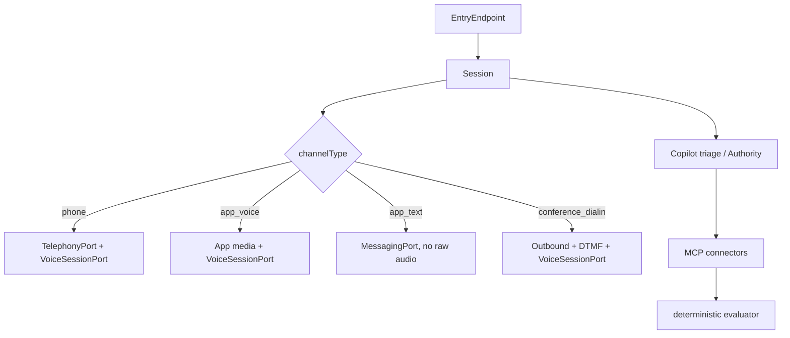

# ADR-0003: Channels, entry endpoints, and MCP connectors

- Date: 2026-09-12
- Status: Accepted
- Decision owners: product owner, foundation maintainers
- Related: [ADR-0001](0001-call-engine-foundation.md), [ADR-0002](0002-secretary-domain-model.md), [ADR-0004](0004-open-source-boundary.md)
- Source: internal ADR-0003 (Chinese)

## Decision

Generalize the domain from "phone call" to **session + entry endpoint + connector** before ports freeze "number" into the public contract. Phone remains the first channel, not the only model.

This ADR freezes vocabulary, identity-signal ceilings, the MCP plugin standard, and the near-term conference path. It does not implement adapters and does not rename existing `/v1` fields. Dual names land at extract time: `calls` stays as the phone alias of `sessions`.

| Concept | Meaning | Current mapping |
|---|---|---|
| `Session` | One conversation with a `channelType`; may have many legs, messages, escalations | `Call` / `PhoneCall`. v1 may keep `Call`; it is `channelType=phone`. |
| `ChannelType` | `phone`, `app_voice`, `app_text`, `conference_dialin` (`conference_bot` later) | Implied phone today. Unsupported types return `CAPABILITY_UNAVAILABLE`. |
| `EntryEndpoint` | Addressable entry: E.164, conference dial-in, app device | `Line.number`, campaign inbound number (metadata only). |
| `Line` | Phone routing container bound to an Assistant and phone endpoints | Existing `Line`. Do not stuff meeting links or device tokens into `Line.number`. |
| `Connector` | External tool set exposed over MCP | Copilot tools / future approval port. No second plugin ABI. |
| `VoiceSessionPort` | Voice session, decoupled from channel | Same port for every voice channel. |

Dependency direction stays `apps/adapters → core → contracts`. Channel adapters implement `TelephonyPort` or a future `MessagingPort`. Connector adapters implement tool execution and the MCP client. Vendor SDKs stay out of `core`.

## Context

The vision widened from a private phone secretary to an always-on assistant that knows the Owner's context and can act. After phone come app voice/text, conference dial-in, and MCP-connected capabilities such as home automation. ADR-0001 `Call`/`Line` and ADR-0002's PSTN trust matrix would otherwise freeze "call" and "number" into ports at extract time.

## Identity signals

ADR-0002 trust levels still apply. A channel supplies **signals**; it does not auto-promote trust.

- `phone`: caller ID / CNAM / STIR/SHAKEN ceiling is `number_match` when the number hits a Contact, otherwise `unverified`. Example fixture: `+15555550100`.
- `app_voice` / `app_text`: an authenticated Owner session may reach `verified_vip`. Nobody else may impersonate the Owner on this channel. Trust comes from the credential, not from a voice that "sounds like" the Owner.
- `conference_dialin`: we are an outbound leg into a room; other participants stay `unverified`. Disclose AI after joining, before business talk.

Owner-from-own-number asking to unlock a door is the highest-risk social-engineering surface. Number match is at most `number_match`. Low-risk device actions (lights, thermostat) may add a pre-registered hashed passphrase that never enters the prompt; failure goes to push or voicemail, not execute. High-risk actions (locks, garage, alarm, payment, sensitive knowledge) require Owner-app push confirm. A spoken "it's me" is never enough. The passphrase is a per-session device grant, not a `trustLevel` upgrade and not a second Owner approval.

## Connectors: MCP is the plugin standard

The engine is an MCP client to an allowlisted server. Tool calls still pass ADR-0002's deterministic Authority evaluator. The model only proposes.

MCP `ToolAnnotations` are **hints**. They must not drive allow/deny for an untrusted server. Mapping below applies only to allowlisted, source-verified connectors. Community servers ignore annotations and default to `high` + `require_approval`.

| Allowlisted annotation | Risk | Default authority |
|---|---|---|
| `readOnlyHint=true` | `observe` | `allow` (still under visibility/budget). Output stays untrusted. |
| write, not destructive, idempotent | `low` | Owner self-serve with `number_match`+passphrase or an app session; other callers `deny`. |
| write, not destructive, not idempotent | `medium` | `require_approval` or a tenant-explicit limited `allow`. |
| `destructiveHint=true` | `high` | `require_approval`. Phone passphrase is not enough. |
| `openWorldHint=true` (stacked) | at least one step up | Extra budget and audit. |
| missing annotations or untrusted server | `high` | `require_approval` or `deny`. |

Tenants may tighten (raise `low` to `require_approval`). They must not drop `high` to "passphrase on the phone". Official OAuth connectors (calendar, mail) stay on the hosted service; see [ADR-0004](0004-open-source-boundary.md). Open-source core ships the MCP client, the risk table, and a mock connector.

The existing desktop MCP surface is a **client of `/v1`**, not a connector plugin. Direction: external MCP servers provide tools; the Mishu MCP server is a control-plane entry.

Home Assistant's official MCP Server integration is the intended home path. "HA already exposed this entity" is not an Authority `allow`. Locks, garage, and alarm stay `high` even when HA exposes them.

## Conference dial-in (near term)

Phone dial-in, not a video bot:

1. Parse dial-in number, meeting id, and PIN from the Owner's invite (secrets stay in the adapter, not the prompt).
2. Place the outbound call under ADR-0001 consent (Owner-initiated, Owner's errand, AI disclosure).
3. Send DTMF for meeting id and PIN.
4. After joining, disclose AI **before** speaking to the room.
5. Busy, bad PIN, or lobby timeout fall back to message/notify. Do not retry into an abuse threshold.

Google Meet (Workspace dial-in only), Zoom, and Teams Audio Conferencing are documented adapter targets. Full video robots are a later `conference_bot` and out of this ADR. DTMF timing is adapter config, not a core state machine. Missing `channel.conference_dialin` returns `CAPABILITY_UNAVAILABLE`; it must not silently degrade to "call the host's mobile".

## Cross-channel memory

Summaries and todos may land in tenant knowledge/inbox after a session, with provenance (`phone` vs `app_text`). Provenance does **not** widen visibility. `never_disclose` on a call does not become `public` because the Owner later typed it in the app. Cross-channel splice still needs ADR-0002 Owner confirmation before it becomes knowledge.

The Codex app-server (optional local adapter) remains local-only and is orthogonal to channel type. A cloud `phone` session must not claim `voice.codex_local`. Local engines may connect loopback MCP and must treat it as untrusted/high risk. Cloud connects allowlist only.

## Consequences

Core thinks in session / entry / connector before extract, so phone is the first channel rather than the only model. v1 keeps the `calls` alias and new fields together, and must maintain an MCP allowlist plus the risk table. Home automation and dial-in depend on peer configuration; "dial-in disabled" or "entity not exposed" are expected failures, not engine bugs.

## Invariants

1. Before core extract, the public contract must be able to express `Session.channelType` and `EntryEndpoint`. Ports must not encode "phone only".
2. Number, CNAM, STIR/SHAKEN, meeting PIN, or "I am the owner" never prove speaker identity alone.
3. Untrusted MCP `ToolAnnotations` never produce `allow`. Missing annotations are `high`.
4. High-risk connector actions need Owner-app push confirm. A phone passphrase cannot approve them.
5. A low-risk passphrase grants only this session's device right. It does not raise `trustLevel` and does not enter the prompt in plaintext.
6. Conference dial-in discloses AI after join and before business talk. Lobby/PIN failure must not loop-dial.
7. `EntryEndpoint` and campaign number maps must not reconfigure vendor routing or forge caller ID.
8. Cross-channel memory must not widen knowledge visibility or Authority. Provenance is required.
9. Raw audio stays on the media plane. MCP, `/v1` JSON, and webhooks do not carry audio.
10. Connector output is as untrusted as caller transcript.

## Alternatives rejected

- A homemade plugin ABI: MCP already has tools, annotations, and auth.
- Number match as "it's the Owner": restates ADR-0002; home automation turns a wrong word into an unlocked door.
- Video conference bots as the near-term path: fragmented platform APIs; dial-in reuses outbound + DTMF.
- Reusing `Line.number` for every entry: meeting links and device tokens are not E.164.

## Resolved questions

- `/v1` names: dual name at extract; `calls` remains the phone alias.
- Low-risk passphrase: hashed shared passphrase as a phone supplement; app remains the main path.
- User-supplied MCP: cloud allowlist only; local loopback allowed and treated as untrusted/high.
- Extra telephony vendors: after the Twilio production path is stable; they do not block extract.
- `conference_bot`: not in the public API beta; public API offers phone dial-in first.
