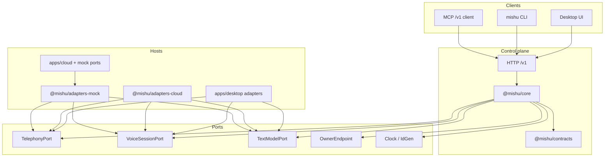

# Architecture

Mishu (working name) is one call engine behind one versioned `/v1` HTTP contract. Desktop UI, the `mishu` CLI, MCP, and third-party agents are clients of that contract. IPC may stay as a desktop-internal shortcut; it is not a second domain API.

This page describes the tree as it exists today. The public snapshot maps the private-repo desktop root to `apps/desktop/` (see `scripts/oss/snapshot-manifest.json`).

## Packages and apps

| Path | Package / app | Role |
|---|---|---|
| `packages/contracts` | `@mishu/contracts` | OpenAPI, JSON Schema, events, errors, generated DTOs. Depends on nothing else in the workspace. |
| `packages/core` | `@mishu/core` | Call-engine decisions, platform policy, knowledge disclosure, hangup judge, handoff state machine, and the five ports. |
| `packages/adapters-cloud` | `@mishu/adapters-cloud` | Twilio Voice / Media Streams / Conference and OpenAI Responses adapters. |
| `packages/adapters-mock` | `@mishu/adapters-mock` | Deterministic clock, telephony, voice, and text-model fakes, plus reusable port-contract helpers. |
| `apps/desktop` | desktop host | Electron local engine (private repo: repo root `src/`, `server/`, `package.json`). |
| `apps/cloud` | `@mishu/cloud` | Headless single-tenant `/v1` reference host. Same engine stores and router as desktop; default ports are mock. No billing, Trust Hub, or production secrets. |
| `apps/cli` | `mishu` | CLI client of `/v1` (private repo: `cli/`). |

There is no `packages/adapters-local` package yet. Desktop adapters live in the desktop host (`apps/desktop/src/main/...`).

## Dependency direction and boundary lint

```text
apps/*, adapters-*  -->  @mishu/core  -->  @mishu/contracts
```

`pnpm lint:boundaries` (`scripts/check-core-imports.mjs`) is the first step of `pnpm check`. It enforces:

- **core** does not import `electron`, `node:sqlite`, `fs`, host globals, or vendor SDKs.
- **contracts** does not depend on core, apps, or adapters.
- **adapters-cloud** may import vendor SDKs and `@mishu/core`; it must not import `electron` or `spikes/`.
- **adapters-mock** must not import vendor SDKs or network modules.
- **apps/cloud** must not import `electron`, the desktop renderer, `phone-gateway`, or the desktop approval presenter.
- Host-agnostic engine files under `src/main/http` and `src/main/services` must not import `electron`.

## Five ports

Core talks to the host only through ports. Implementations stay in adapters. Extracted today:

1. `TelephonyPort` — dial, answer, reject, hangup, `transferToOwner`.
2. `VoiceSessionPort` — start / close a voice session, discard queued playback, fallback voicemail note.
3. `TextModelPort` — one-shot structured `complete`.
4. Handoff `OwnerEndpoint` — `client` / `pstn` / `local_takeover` (core owns the state machine; adapters own Conference or local audio).
5. `Clock` / `IdGen` — injectable time and ids.

See [ports.md](ports.md) for the interfaces and adapter map. Persistence, secrets, webhooks, approvals, and number provisioning are not ports yet; desktop and `apps/cloud` share the same SQLite stores.

## One engine, three planes



- **Control plane:** tenant, campaign/assistant, call, handoff, message, event. JSON only. Raw audio never appears here.
- **Media plane:** PSTN/VoIP audio, legs, playback, transfer. Desktop uses WebRTC media tracks; the cloud production path is Twilio Media Streams to GPT-Live WebSocket (`pcmu-8k` or `pcm24k`). ConversationRelay is a documented fallback, not the production path.
- **Intelligence plane:** prompt compiler, hard rules, copilot suggestions, hangup judge. Model text is a suggestion, not domain truth.

The Codex app-server (optional local adapter) is local-only. Cloud hosts must not select it or resell that login.

## Dual-engine contract tests

The same black-box kit in `tests/contract/*.contract.ts` must pass against every engine:

| Command | Engine |
|---|---|
| `pnpm test:contract` | Local desktop `/v1` (mock phone; Electron global setup when `CONTRACT_BASE_URL` is unset). |
| `pnpm test:contract:cloud` | `apps/cloud` reference host. |
| `CONTRACT_BASE_URL` + `CONTRACT_TOKEN` | Any other engine that speaks `/v1`. |

Fourteen cases cover auth, errors, idempotency, campaigns, contacts, tasks, calls, webhooks, and secret leakage. Fixtures use `+1555…` only. The suite does not dial PSTN or call paid APIs.

Webhook deliveries are JSON POSTs with `X-Mishu-Signature` (`t=<unix-ms>,v1=<hex>` over `{unix-ms}.{rawBody}`), `X-Mishu-Event`, and `X-Mishu-Delivery-Id`. See `examples/webhook-receiver` and `docs/api/README.md`.

Separately, `@mishu/adapters-mock/contract-tests` exports `describeTelephonyPortContract`, `describeVoiceSessionPortContract`, `describeTextModelPortContract`, and `describeClockContract`. Desktop, cloud, and mock adapters each run those helpers so a port implementation cannot drift from the interface.

## Guardrails

Official builds compile platform policy in `@mishu/core` before campaign text. Opening AI disclosure is mandatory; a campaign cannot disable it. See [guardrails.md](guardrails.md).

## Next

- [Quickstart](quickstart.md)
- [Ports](ports.md)
- [ADR summaries](adr/0001-call-engine-foundation.md)
